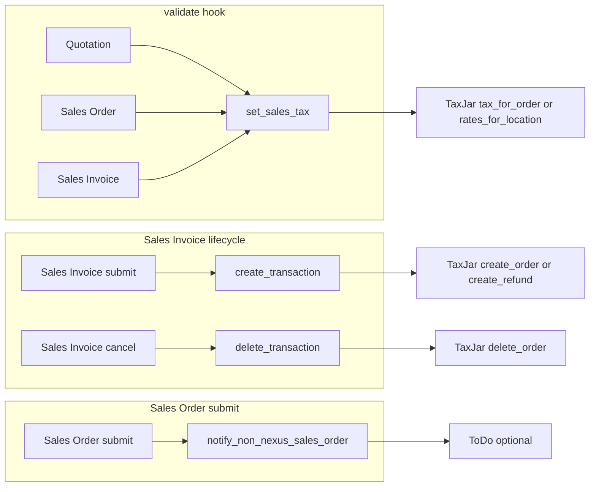

<!-- Copyright (c) 2026, Washmore Development, AgriTheory and contributors
For license information, please see license.txt-->

# Integration

[← Documentation index](index.md) · [Setup](setup.md)

## Architecture overview

### Document hooks

Defined in [`hooks.py`](../taxjar_erpnext/hooks.py):

| Document | Event | Handler |
|----------|--------|---------|
| Quotation, Sales Order, Sales Invoice | `validate` | `set_sales_tax` |
| Sales Invoice | `on_submit` | `create_transaction` |
| Sales Invoice | `on_cancel` | `delete_transaction` |
| Sales Order | `on_submit` | `notify_non_nexus_sales_order` |

### Core module

Business logic lives in [`taxjar_erpnext/taxjar_erpnext/taxjar_erpnext.py`](../taxjar_erpnext/taxjar_erpnext/taxjar_erpnext.py): building the TaxJar order payload (`get_tax_data`), nexus checks, exemptions, `tax_for_order` and `rates_for_location` calls, tax row updates, transaction create and delete, and non-nexus notifications.

### High-level flow

---

## DocTypes reference

### TaxJar Account

- Location: [`doctype/taxjar_account/`](../taxjar_erpnext/taxjar_erpnext/doctype/taxjar_account/)
- Naming: one document per Company (`autoname` on `company`).
- Main fields:
  - Enable Tax Calculation — required for the app to treat this account as active (`get_taxjar_account`).
  - Sandbox Mode — uses sandbox API URL and Sandbox API Key when enabled; otherwise Live API Key.
  - Create TaxJar Transaction — when enabled, submitted Sales Invoices create TaxJar orders or refunds (subject to further checks in code).
  - Tax Account Head and Shipping Account Head — GL accounts used to identify sales tax and shipping amounts in the document taxes table for TaxJar payloads and transaction totals (see [Setup](setup.md) for a posting example).
- Non-nexus settings:
  - Calculate Estimated Tax for All States — affects Quotations only for destinations outside nexus (see [Tax calculation behavior](#tax-calculation-behavior)).
  - Notify User on Non-Nexus Sales Orders and Notification Recipient — optional ToDo on Sales Order submit when shipping to a state without nexus.
- Nexus child table — read-only on the form; populated from TaxJar via Update Nexus List.

### TaxJar Nexus

- Location: [`doctype/taxjar_nexus/`](../taxjar_erpnext/taxjar_erpnext/doctype/taxjar_nexus/)
- Child row on TaxJar Account: region, region code, country, country code. Used to compare destination `to_state` against registered nexus.

### Product Tax Category

- Location: [`doctype/product_tax_category/`](../taxjar_erpnext/taxjar_erpnext/doctype/product_tax_category/)
- Maps Product Tax Code (TaxJar) to a name and description. Default categories are seeded from [`product_tax_category_data.json`](../taxjar_erpnext/taxjar_erpnext/doctype/taxjar_account/product_tax_category_data.json) when the app is installed (`after_install` in [`hooks.py`](../taxjar_erpnext/hooks.py) → [`install.py`](../taxjar_erpnext/install.py)); rows that already exist for a given product tax code are skipped.

---

## Custom fields and data model

Custom fields are defined under [`taxjar_erpnext/taxjar_erpnext/custom/`](../taxjar_erpnext/taxjar_erpnext/custom/) (`item.json`, `sales_invoice_item.json`) with `sync_on_migrate: 1`, so they load on `bench migrate` like other Frappe app customizations and are checked by this repo’s `validate_customizations` pre-commit hook.

| DocType | Fields added |
|---------|----------------|
| Item | `product_tax_category` — Link to Product Tax Category |
| Sales Invoice Item | `product_tax_category` (fetch from `item_code.product_tax_category`), `tax_collectable`, `taxable_amount` (read-only currency) |

Product tax codes sent to TaxJar come from each line’s `product_tax_category` value (linked category code in `get_line_item_dict`, [`taxjar_erpnext.py`](../taxjar_erpnext/taxjar_erpnext/taxjar_erpnext.py)).

Per-line tax breakdown: `tax_collectable` and `taxable_amount` are filled only when `tax_for_order` returns a response with a `breakdown.line_items` structure. The non-nexus quotation path using `rates_for_location` does not provide line-level detail; those item fields are cleared in that case.

---

## Tax calculation behavior

### When `set_sales_tax` runs

On `validate` for Quotation, Sales Order, and Sales Invoice ([`hooks.py`](../taxjar_erpnext/hooks.py)).

The function returns immediately when:

- No enabled TaxJar Account exists for `doc.company`.
- Company region is not United States.
- There are no items.
- Sales tax exemption applies ([`check_sales_tax_exemption`](../taxjar_erpnext/taxjar_erpnext/taxjar_erpnext.py)): document `exempt_from_sales_tax` and/or Customer `exempt_from_sales_tax` (if the Customer field exists). For Quotation, customer-level exemption uses `party_name` only when Quotation To is Customer (not Lead).

### Nexus gating

- Nexus is determined by matching the destination state (`to_state` in the built tax dict) against TaxJar Nexus rows on the company’s TaxJar Account.
- If there is no nexus match, TaxJar tax rows are removed and calculation stops, except for Quotation when Calculate Estimated Tax for All States is enabled; then calculation continues for quoting purposes.

### API usage

- Primary calculation: `client.tax_for_order(tax_dict)` inside `validate_tax_request`.
- Non-nexus Quotation with Calculate Estimated Tax for All States: if `tax_for_order` does not yield a positive `amount_to_collect`, the integration may fall back to `rates_for_location` on the destination ZIP, city, state, and country (`get_tax_rate_for_location`), applying the combined rate to `net_total`. The tax charge description is Estimated Sales Tax whenever that non-nexus quotation mode applies or the rate fallback is used (see `set_sales_tax` in [`taxjar_erpnext.py`](../taxjar_erpnext/taxjar_erpnext/taxjar_erpnext.py)).

Estimated rates for non-nexus states do not apply product tax category exemptions; quotes may show higher tax than would be collected on a real order. This matches the warning on the TaxJar Account DocType.

### Addresses and constants

- `get_tax_data` builds from and to country, ZIP, state, city, street, shipping, net total, and line items.
- `SUPPORTED_STATE_CODES` and `SUPPORTED_COUNTRY_CODES` in [`taxjar_erpnext.py`](../taxjar_erpnext/taxjar_erpnext/taxjar_erpnext.py) constrain supported geographies; user-facing errors reference valid US state codes in several validation branches.

---

## Transaction reporting (TaxJar orders and refunds)

Triggered from Sales Invoice `on_submit` and `on_cancel` ([`hooks.py`](../taxjar_erpnext/hooks.py)).

### Create (`create_transaction`)

Requires:

- TaxJar Account for the company with Enable Tax Calculation (same `get_taxjar_account` as elsewhere) and Create TaxJar Transaction enabled.
- A working API client (`get_client`).
- Positive sales tax summed from tax rows whose account head equals Tax Account Head.
- Successful `get_tax_data` payload.

Behavior:

- Normal invoice: `client.create_order(...)`.
- Return invoice (`is_return`): `client.create_refund(...)`.

On `TaxJarResponseError`, submission fails with a sanitized message (`sanitize_error_response`).

### Delete (`delete_transaction`)

On invoice cancel, calls `client.delete_order(doc.name)`. `TaxJarResponseError` is ignored (for example when the transaction was already removed).

---

## Non-nexus Sales Order notifications

When Notify User on Non-Nexus Sales Orders and Notification Recipient are set, Sales Order `on_submit` runs `notify_non_nexus_sales_order`: if the ship-to state is not in the nexus list, a ToDo is created for the recipient. Errors are logged and do not block Sales Order submission.

---

## Limitations and operational notes

- US-only for automatic calculation: non–United States companies skip `set_sales_tax` logic even if a TaxJar Account exists.
- Transaction creation requires tax on the configured account: if there is no tax amount on Tax Account Head, `create_transaction` returns without calling TaxJar.
- Non-nexus quotation estimates may overstate tax (no product-level exemption in the `rates_for_location` path); see DocType help text on Calculate Estimated Tax for All States.
- Line-item breakdown on rows depends on TaxJar `tax_for_order` breakdown; otherwise item tax fields are zeroed.
- `get_taxjar_account` is shared: disabling Enable Tax Calculation removes the account from lookup, which disables the API client for that company and prevents transaction hooks from finding configuration.
