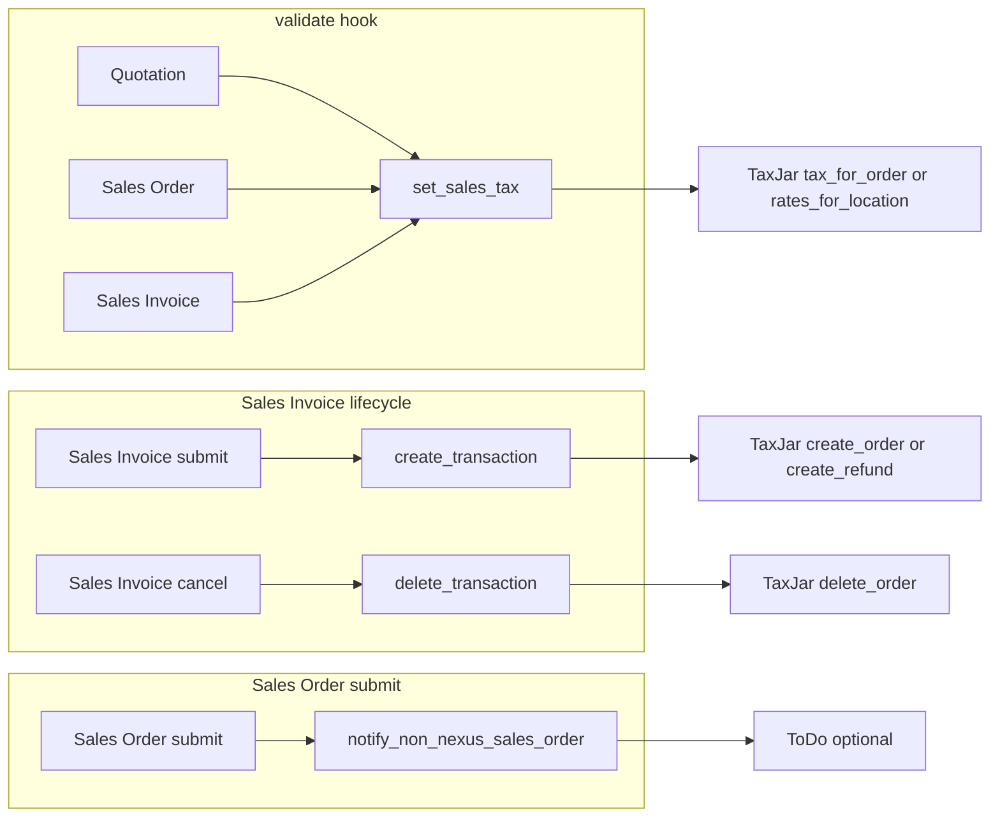

<!-- Copyright (c) 2026, Washmore Development, AgriTheory and contributors
For license information, please see license.txt-->

# Integration

  Tyler Matteson 2026-06-23

[← Documentation index](index.md) · [Setup](setup.md)

Technical reference for how the app hooks into ERPNext and calls TaxJar. Configuration steps live in [Setup](setup.md); expected UI behavior by document type is documented there as well.

---

## Architecture

### Document hooks

Defined in [`hooks.py`](../taxjar_erpnext/hooks.py):

| Document | Event | Handler |
|----------|--------|---------|
| Quotation, Sales Order, Sales Invoice | `validate` | `set_sales_tax` |
| Sales Invoice | `on_submit` | `create_transaction` |
| Sales Invoice | `on_cancel` | `delete_transaction` |
| Sales Order | `on_submit` | `notify_non_nexus_sales_order` |

Business logic is in [`taxjar_erpnext.py`](../taxjar_erpnext/taxjar_erpnext/taxjar_erpnext.py): payload assembly (`get_tax_data`), nexus checks, exemptions, TaxJar API calls, tax row updates, transaction sync, and non-nexus notifications.

### Stack

| Component | Notes |
|-----------|--------|
| Frappe / ERPNext | v15.x (`pyproject.toml`, `[tool.bench.frappe-dependencies]`) |
| Python `taxjar` client | Project dependencies |
| `pycountry` | State and subdivision resolution for addresses |
| TaxJar API | Header `x-api-version: 2022-01-24` in `get_client` |

---

## DocTypes

### TaxJar Account

[`doctype/taxjar_account/`](../taxjar_erpnext/taxjar_erpnext/doctype/taxjar_account/)

| Field | Role in code |
|-------|----------------|
| `company` | Document name (`autoname`); one account per company |
| `taxjar_calculate_tax` | Must be set for `get_taxjar_account` to return this account |
| `is_sandbox` | Selects sandbox URL and `sandbox_api_key` vs live `api_key` |
| `taxjar_create_transactions` | Gates `create_transaction` / `delete_transaction` |
| `tax_account_head` | Identifies sales tax rows in `doc.taxes` |
| `shipping_account_head` | Shipping amount in TaxJar payload |
| `calculate_tax_for_all_states` | Allows non-nexus Quotation calculation |
| `notify_on_non_nexus_sales` / `non_nexus_notification_user` | Gates non-nexus ToDo on Sales Order submit |
| `nexus` | Child table; destination `to_state` matched against `region_code` |

Validation: `validate_tax_calculation_settings` rejects Sandbox Mode or Create TaxJar Transaction when Enable Tax Calculation is off. Nexus is refreshed via whitelisted `update_nexus_list` (form button **Update Nexus List**).

Product tax categories are seeded from [`product_tax_category_data.json`](../taxjar_erpnext/taxjar_erpnext/doctype/taxjar_account/product_tax_category_data.json) on `after_install` ([`install.py`](../taxjar_erpnext/install.py)) and on TaxJar Account `on_update` when tax calculation is enabled and the Product Tax Category table is empty (`setup_product_tax_categories_if_needed`).

### TaxJar Nexus

[`doctype/taxjar_nexus/`](../taxjar_erpnext/taxjar_erpnext/doctype/taxjar_nexus/) — child row: region, region code, country, country code.

### Product Tax Category

[`doctype/product_tax_category/`](../taxjar_erpnext/taxjar_erpnext/doctype/product_tax_category/) — maps TaxJar `product_tax_code` to name and description. Existing codes are skipped on seed.

---

## Custom fields

JSON under [`taxjar_erpnext/taxjar_erpnext/custom/`](../taxjar_erpnext/taxjar_erpnext/custom/) with `sync_on_migrate: 1`.

| DocType | Fields |
|---------|--------|
| Item | `product_tax_category` |
| Item Default | `product_tax_category` |
| Sales Invoice Item | `product_tax_category`, `tax_collectable`, `taxable_amount` |

**Resolution** ([`resolve_product_tax_category`](../taxjar_erpnext/taxjar_erpnext/taxjar_erpnext.py)): line value → company Item Default via `get_item_defaults`. On Sales Invoice `validate`, blank lines are backfilled before the API call.

**Line breakdown:** `tax_collectable` and `taxable_amount` are custom fields on Sales Invoice Item only. Populated from `tax_for_order` → `breakdown.line_items`. Cleared when using `rates_for_location` or when no breakdown is returned. Quotation and Sales Order get document-level tax rows only.

**Mixed carts:** `tax_for_order` may return tax on a subset of lines; document total and (on invoice) per-line fields reflect TaxJar’s response.

---

## Tax calculation pipeline

### Entry and early exit

`set_sales_tax` runs on `validate`. It returns without calling TaxJar when:

- No enabled TaxJar Account for `doc.company` (`get_taxjar_account`)
- `get_region(doc.company) != "United States"`
- No line items
- Exemption applies ([`check_sales_tax_exemption`](../taxjar_erpnext/taxjar_erpnext/taxjar_erpnext.py)): document `exempt_from_sales_tax`, or Customer `exempt_from_sales_tax` when the column exists (ERPNext US regional setup). On Quotation, customer exemption uses `party_name` only when Quotation To is Customer.

If `get_tax_data` returns `None` (missing address, country code, etc.), TaxJar tax rows are removed and line tax fields zeroed.

### Nexus

[`check_for_nexus`](../taxjar_erpnext/taxjar_erpnext/taxjar_erpnext.py) compares destination `to_state` to nexus `region_code`. No match → cleanup and stop, except Quotation with `calculate_tax_for_all_states`.

### TaxJar API

| Path | Method | When |
|------|--------|------|
| Primary | `client.tax_for_order(tax_dict)` | Nexus match (or non-nexus quote with estimate setting) |
| Fallback | `client.rates_for_location(...)` | Non-nexus Quotation when `tax_for_order` returns no collectable amount |

Fallback applies combined rate to `net_total`; tax row description is **Estimated Sales Tax**. Product tax category exemptions are not applied on this path.

### Payload assembly

[`get_tax_data`](../taxjar_erpnext/taxjar_erpnext/taxjar_erpnext.py) builds from/to addresses (company address via `get_company_address`; destination via shipping address → customer address → company fallback), shipping from taxes table, `net_total`, and line items from [`get_line_item_dict`](../taxjar_erpnext/taxjar_erpnext/taxjar_erpnext.py).

State codes are normalized with `pycountry` ([`get_iso_3166_2_state_code`](../taxjar_erpnext/taxjar_erpnext/taxjar_erpnext.py)) and validated against `SUPPORTED_STATE_CODES`. `SUPPORTED_COUNTRY_CODES` covers address parsing; calculation remains US-only via region check.

API errors on validate throw **TaxJar Calculation Error** with sanitized `detail` ([`sanitize_error_response`](../taxjar_erpnext/taxjar_erpnext/taxjar_erpnext.py)).

---

## Transaction sync

Sales Invoice `on_submit` / `on_cancel` when `taxjar_create_transactions` is enabled and `get_client` succeeds.

**Create** ([`create_transaction`](../taxjar_erpnext/taxjar_erpnext/taxjar_erpnext.py)) requires positive tax on Tax Account Head and a valid `get_tax_data` payload. Calls `create_order` or `create_refund` (`is_return`). Submitted payloads include per-line `sales_tax` from `tax_collectable` when `docstatus == 1`. Failures throw **TaxJar Transaction Error** and block submit.

**Delete** ([`delete_transaction`](../taxjar_erpnext/taxjar_erpnext/taxjar_erpnext.py)) calls `delete_order(doc.name)`; `TaxJarResponseError` is ignored.

---

## Non-nexus notifications

[`notify_non_nexus_sales_order`](../taxjar_erpnext/taxjar_erpnext/taxjar_erpnext.py) on Sales Order `on_submit`. Creates a ToDo when destination state is outside nexus. Wrapped in try/except; errors log as **TaxJar Non-Nexus Notification Failed** and never block submission.

---

## Limitations

- US companies only for `set_sales_tax`, regardless of TaxJar Account presence.
- `create_transaction` skips when tax on Tax Account Head is zero.
- Non-nexus quote estimates may overstate tax (no product exemption on `rates_for_location` path).
- Line breakdown on invoice rows requires TaxJar `breakdown.line_items`.
- Disabling Enable Tax Calculation removes the company from `get_taxjar_account`, disabling calculation, client access, and transaction hooks for that company.
